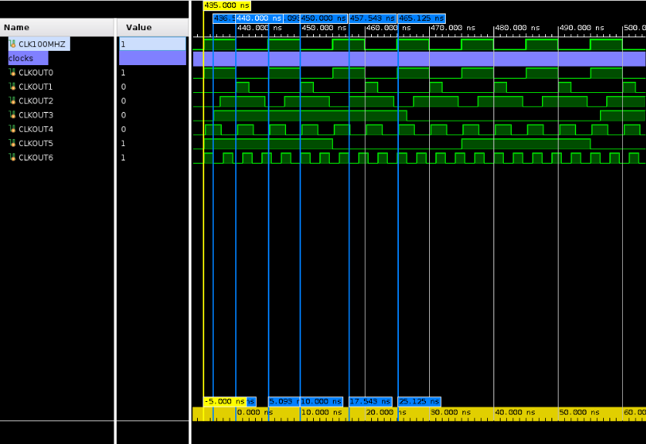

# Daniel Nybo 

**MMCM** - *Approx 10 Hours Spent*

**Summary of Major Challenges**

I spent some time making sure I had the circuts for the clock domain crossing correct but I spent most of my time looking at the timing report to see which signals were causing my timing to fail. It was a great excersise to learn how to navigate this report and get to the bottom of timing issues quickly.

## Assignment Specific Responses

**Resources**:

+-------------------------+------+-------+------------+-----------+-------+
|        Site Type        | Used | Fixed | Prohibited | Available | Util% |
+-------------------------+------+-------+------------+-----------+-------+
| Slice LUTs              |  333 |     0 |          0 |     63400 |  0.53 |
|   LUT as Logic          |  333 |     0 |          0 |     63400 |  0.53 |
|   LUT as Memory         |    0 |     0 |          0 |     19000 |  0.00 |
| Slice Registers         |  427 |     0 |          0 |    126800 |  0.34 |
|   Register as Flip Flop |  427 |     0 |          0 |    126800 |  0.34 |
|   Register as Latch     |    0 |     0 |          0 |    126800 |  0.00 |
| F7 Muxes                |   40 |     0 |          0 |     31700 |  0.13 |
| F8 Muxes                |    4 |     0 |          0 |     15850 |  0.03 |
+-------------------------+------+-------+------------+-----------+-------+

+-----------------------------+------+-------+------------+-----------+-------+
|          Site Type          | Used | Fixed | Prohibited | Available | Util% |
+-----------------------------+------+-------+------------+-----------+-------+
| Bonded IOB                  |   49 |    49 |          0 |       210 | 23.33 |
|   IOB Master Pads           |   24 |       |            |           |       |
|   IOB Slave Pads            |   22 |       |            |           |       |
| Bonded IPADs                |    0 |     0 |          0 |         2 |  0.00 |
| PHY_CONTROL                 |    0 |     0 |          0 |         6 |  0.00 |
| PHASER_REF                  |    0 |     0 |          0 |         6 |  0.00 |
| OUT_FIFO                    |    0 |     0 |          0 |        24 |  0.00 |
| IN_FIFO                     |    0 |     0 |          0 |        24 |  0.00 |
| IDELAYCTRL                  |    0 |     0 |          0 |         6 |  0.00 |
| IBUFDS                      |    0 |     0 |          0 |       202 |  0.00 |
| PHASER_OUT/PHASER_OUT_PHY   |    0 |     0 |          0 |        24 |  0.00 |
| PHASER_IN/PHASER_IN_PHY     |    0 |     0 |          0 |        24 |  0.00 |
| IDELAYE2/IDELAYE2_FINEDELAY |    0 |     0 |          0 |       300 |  0.00 |
| ILOGIC                      |    0 |     0 |          0 |       210 |  0.00 |
| OLOGIC                      |    0 |     0 |          0 |       210 |  0.00 |
+-----------------------------+------+-------+------------+-----------+-------+

**Warnings**:

No warnings to report

**Timing**:

WNS: 0.235 this occurs in the clock 6 time domain which is significantly faster than other clock domains at 333 MHz meaning there is only 3ns period to begin with. 

**waveform**:

Here is a waveform of the 7 clocks of the design. They correspond to the requirments in the spec with proper phase offsets, duty cycles, and periods as can be seen with the markers in the waveform. 

